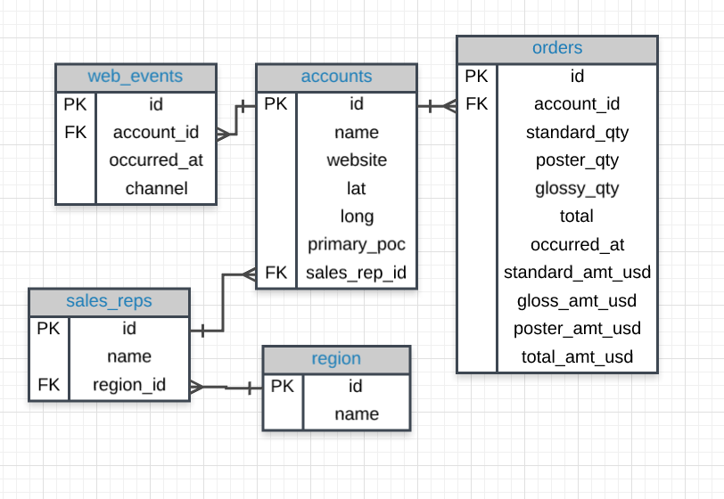

# SQL Joins

## Primary and Foreign Keys
You learned a key element for JOINing tables in a database has to do with primary and foreign keys:

* **primary keys** - are unique for every row in a table. These are generally the first column in our database (like you saw with the **id** column for every table in the Parch & Posey database).

* **foreign keys** - are the **primary key** appearing in another table, which allows the rows to be non-unique.

Choosing the set up of data in our database is very important, but not usually the job of a data analyst. This process is known as **Database Normalization**.

## JOINs
In this lesson, you learned how to combine data from multiple tables using JOINs. The three JOIN statements you are most likely to use are:

1. **JOIN** - an **INNER JOIN** that only pulls data that exists in both tables.
1. **LEFT JOIN** - pulls all the data that exists in both tables, as well as all of the rows from the table in the **FROM** even if they do not exist in the **JOIN** statement.
1. **RIGHT JOIN** - pulls all the data that exists in both tables, as well as all of the rows from the table in the **JOIN** even if they do not exist in the **FROM** statement.

There are a few more advanced **JOINs** that we did not cover here, and they are used in very specific use cases. [**UNION and UNION ALL**](https://www.w3schools.com/sql/sql_union.asp), [**CROSS JOIN**](https://www.w3schools.com/sql/sql_union.asp), and the tricky [**SELF JOIN**](https://www.w3schools.com/sql/sql_join_self.asp). These are more advanced than this course will cover, but it is useful to be aware that they exist, as they are useful in special cases.

## Alias
You learned that you can alias tables and columns using **AS** or not using it. This allows you to be more efficient in the number of characters you need to write, while at the same time you can assure that your column headings are informative of the data in your table.

## Reference for joining tables
Use the following image as reference for joining the tables in this lesson. It is obtained from [this](https://video.udacity-data.com/topher/2017/October/59e946e7_erd/erd.png) Udacity link.

